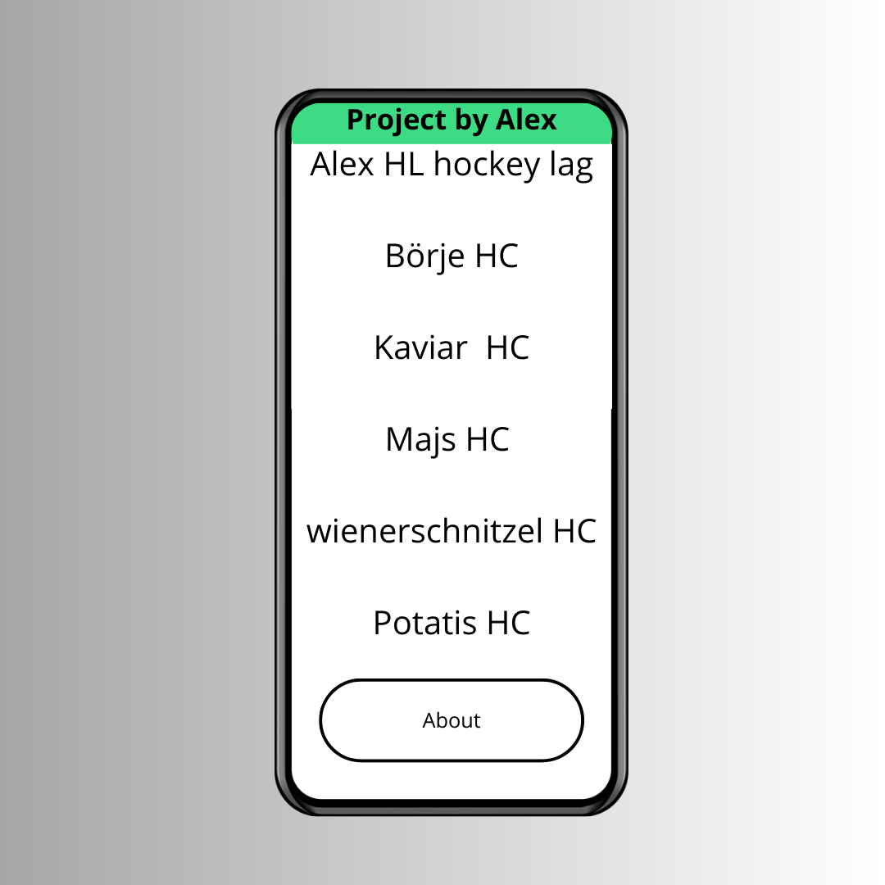
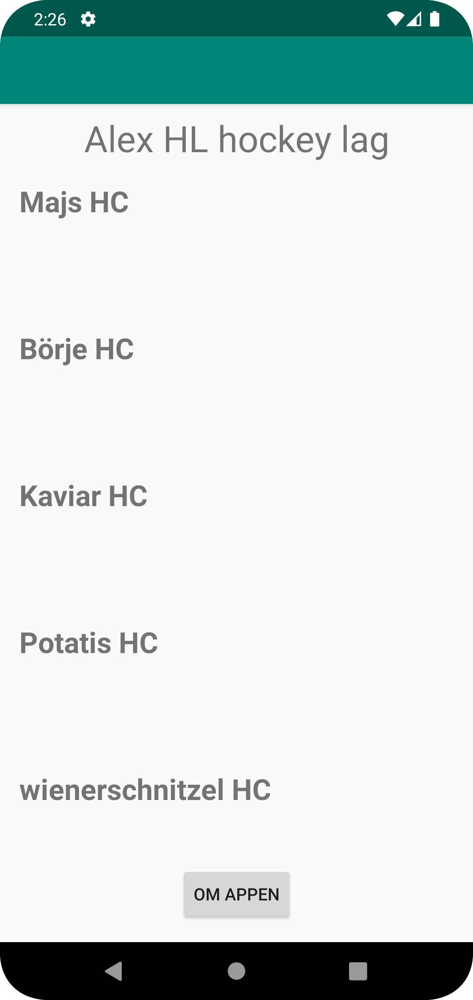
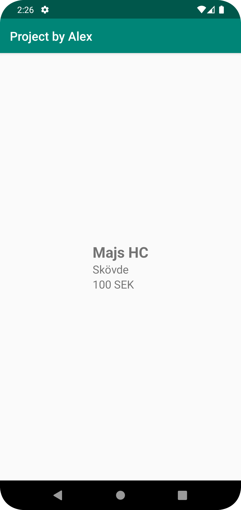
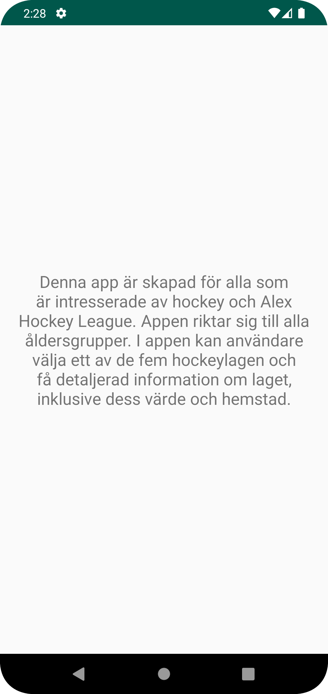

# Rapport
# Inledning
Detta projekt gick ut på att skapa en app som ska kunna läsa json data från URL som man själv skapade där man la in egen information.
Denna app så var informationen om 5 olika hockey lag från en påhittad hockey league som är den påhittade league vid namn av Alex HL.

# Skiss: 
Skapade en skiss på hur appen utseendet kan se ut med hjälp av Canva. Skissen är i plan hur det slutliga utseendet på appen ska se ut.
Skissen visar fem olika Hockeylag i en recyclerviewer som sedan med hjälp av att klicka på en av lagen ska man komma in på allmän fakta om lagen som namn, kost och location om laget.
Det finns även en knapp längst ner som tar en till about activity som det ska finnas en kort förklaring på vad appen är för något och vad den är gjord för.

# JSON data
Med hjälp av länken där man skulle lägga till och skapa alla data som ska användas så skapade jag datan för att på hittade hockeylag.
Där jag la till hur mycket det är värt, vilken stad laget finns och namn på hockey laget.
JSON datan: 
```
[{"ID":"a23alera_001","name":"Majs HC","type":"a23alera","company":"","location":"Skövde","category":"","size":0,"cost":100,"auxdata":""},{"ID":"a23alera_002","name":"Börje HC","type":"a23alera","company":"","location":"Göteborg","category":"","size":0,"cost":5000000,"auxdata":""},{"ID":"a23alera_003","name":"Kaviar HC","type":"a23alera","company":"","location":"Skåne","category":"","size":0,"cost":700000,"auxdata":""},{"ID":"a23alera_004","name":"Potatis HC","type":"a23alera","company":"","location":"Falkenberg","category":"","size":0,"cost":80000,"auxdata":""},{"ID":"a23alera_005","name":"wienerschnitzel HC","type":"a23alera","company":"","location":"Stockholm","category":"","size":0,"cost":100000,"auxdata":""}]

```

# Början av appen
Började först med att ändra gradle till 6.7.1 och gradle JDK till corretto 11 för att kunna synka allt så appen kan fungera att starta.
Därefter så implemtnererade jag in recycklerview i app/build.gradle

```
dependencies {
    implementation 'androidx.recyclerview:recyclerview:1.1.0'
    ...
```

För att kunna använda sig och få åtkoms till json datan så fick jag lägga till inter återkomst i app/src/main/AndroidManifest.xml
```
manifest xmlns:android="http://schemas.android.com/apk/res/android"
    ....>
    <uses-permission android:name="android.permission.INTERNET" />
    <application
```

# Implementationsexempel
För att kunna hantera och tolka Json-datan så skapades en JsonTask som är en kopia av vad jag gjorde på uppgift 5 networking.
JsonTask skapades för att kunna hantera en asynkron laddning och tolkningen av JSON-datan. I Json tasken så användes AsynTack för att kunna tolka datan.
I mainactivity anropas JsonTask i jetJson metoden för att hämta data från en URL.
Därefter så implemnterades onPostExecute för att kunna ta emot hämtade JSON-datan. I slutet i parseJson så konverterar Json Strängen till hockeyTeam object se (Figur 1).
Även likt från uppgift 5 om att skapa en klass för att kunna hantera och lagra information om berg så gjordes det likt men anpassade annorlunda för att det ska kunna fungerar för mitt program.
Första används bara toString för att få information men det var något som inte gick och slutade med att använda sig av getters och så all information liknande det man skulle hämta från json.

commit för ändringar för hockeyTeam klassen: https://github.com/a23alera/mobileapp-programming-project/commit/8bbb58f504f3319674c487e9f1d78f7cc853e5ad

Länk till uppgift 5: https://github.com/a23alera/mobileapp-programming-networking/blob/master/app/src/main/java/com/example/networking/JsonTask.java

Därefter skapades en adapterklass för att kunna hantera och presentera listan på hockeylag i recyclerView. Adapter klassen kommer vara en mellansteg mellan recycklerVIew UI och datan som ska visas.
Skapandet av adapterklassen så togs koden och information för att kunna skapa från en gammal föreläsning.
I Adapter klassen så la alla geters in som ska användas från HockeyTeam klassen. I adapter binder hockeyTeam till recyclerView items och hanterar klick händelser för att få upp information om lagen (Figur 2).
I Acitivty_main.xml las det även in en recyclerView. I adapter-klassen så ändras lite från var det är från länken för att göra så att den fungerar för denna app.
En ändring som gjordes var att den ska direkt initiera aktivitet övergången från klick på ett lagnamn.

commit: https://github.com/a23alera/mobileapp-programming-project/commit/0788e010b929d777b3f9c5c3557c2e6bf35cf152

Länk: Föreläsning: https://dugga.iit.his.se/DuggaSys/showdoc.php?exampleid=it351g_widgets_recyclerview.md&courseid=1&coursevers=928742&fname=it351g_widgets_recyclerview.md

För att kunna göra så att vid klick på ett hockeylag så ska information om laget komma fram som hur mycket det är värt och från vilken stad Så skapades en ny acitivty.
Den nya acitivty som heter TeamActivity, TeamActivity tar emot data från MainAcitivty via getintent. Sen skapades en details.xml layout för att visa alla information om lagen.
I slutet så skapades en about acvitity för som ska finnas för att visa för vilka appen är gjord för. Detta gjordes med att koppl AboutAcitivty till en knapp i main. se figur 3.
I koden så i onCreate så kopplas about till en knapp i main.

# Reflektion
Detta project gick ut på att skapa en app där man ska hämta json data från en URL där man ska hämta utvald fakta om något man själv har kommit på. Det som skapades i URL var olika lag och fakta om lagen.
Ett problem som uppstod vid utvecklningen av appen var att det var problem med att lyckas läsa ut datan från URL, detta tog en stod att lösa men efter flera olika försök och kontroll med logcat och hjälp av Log.d för att veta om datan kom fram så löstest problmet.
Problmet var med användningen av tostring i HockeyTeam klassen och även hur URL las in. URL problemet löstest med att lägga in min login i URL. "login=a23alera"
Några olika saker som testades var att försöka få in en tillbaka knapp på på varje skärm för att öka anvädningbarheten för användarna. Detta beslutet tog slut snabbt för att det fanns redan en tillbaka knapp som fungerade bra. 


Kodsnuttar:
* MainActivity: Figur 1
```
public class MainActivity extends AppCompatActivity implements JsonTask.JsonTaskListener {
    ...
    private final String JSON_URL = "https://mobprog.webug.se/json-api?login=a23alera";
    ...
    @Override
    protected void onCreate(Bundle savedInstanceState) {
       ...
    }

    private void getJson() {
        new JsonTask(this).execute(JSON_URL);
    }

    @Override
    public void onPostExecute(String json) {
        hockeyTeams.clear();
        hockeyTeams.addAll(parseJson(json));
        adapter.notifyDataSetChanged();
    }

    private ArrayList<HockeyTeam> parseJson(String json) {
        try {
            JSONArray jsonArray = new JSONArray(json);
            for (int i = 0; i < jsonArray.length(); i++) {
                JSONObject jsonObject = jsonArray.getJSONObject(i);
                String id = jsonObject.getString("ID");
                String name = jsonObject.getString("name");
                ...
                HockeyTeam team = new HockeyTeam(id, name, location, size, cost, auxData, company);
                hockeyTeams.add(team);
            }
            return hockeyTeams;
        } catch (JSONException e) {
            ..
        }
    }
}

```

Figur 2:
```
 @Override
    public void onBindViewHolder(@NonNull ViewHolder holder, final int position) {
        final HockeyTeam team = teams.get(position);
        holder.tvName.setText(team.getName());
        holder.itemView.setOnClickListener(new View.OnClickListener() {
            @Override
            public void onClick(View view) {
                Intent intent = new Intent(context, TeamActivity.class);
                intent.putExtra("Name", team.getName());
                intent.putExtra("Location", team.getLocation());
                intent.putExtra("Cost", team.getCost());
                context.startActivity(intent);
            }
        });
    }
```

figur 3:
```
protected void onCreate(Bundle savedInstanceState) {
        super.onCreate(savedInstanceState);
        setContentView(R.layout.activity_main);
        ...
        Button btnAbout = findViewById(R.id.btnAbout);
        btnAbout.setOnClickListener(new View.OnClickListener() {
            @Override
            public void onClick(View view) {
                Intent intent = new Intent(MainActivity.this, AboutActivity.class);
                startActivity(intent);
            }
        });
    }
```

# Skiss


# Slut produkt


